# 📱 手机电商智能客服 Agent

> 基于 **LangGraph + DeepSeek Tool Calling** 的手机电商智能客服 Agent，面向手机零售场景，覆盖商品咨询、推荐、订单物流查询、售后协作与人工接管，支持权限校验、审计追踪与自动化评测，本地 Docker Compose 一键可复现。

[](https://github.com/shimianye/talk/actions/workflows/ci.yml)
[](https://python.org)
[](https://fastapi.tiangolo.com)
[](https://langchain-ai.github.io/langgraph/)
[](https://www.postgresql.org)
[](https://alembic.sqlalchemy.org/)

> **CI 状态**：GitHub Actions 每次 push/PR 自动跑「迁移 → 种子 → 45 个测试 → 100 条 Mock 评测 → 报告归档」，当前为绿色（最新 [Run #34005899216](https://github.com/shimianye/talk/actions/runs/34005899216)）。

---

## ✨ 项目定位

本项目不是只能回答 FAQ 的聊天机器人，而是一个**可运行、可交付、可评测**的有状态 Agent：

- **消费者端**：商品咨询、参数对比、购买推荐、订单物流查询、售后申请。
- **客服工作台**：人工接管、工单处理、内部备注、执行轨迹查看。
- **管理端**：商品、知识库、用户权限、评测与审计管理。
- **可复现**：Docker Compose 一键启动；无 Key 时用 Mock LLM 跑通全链路。
- **可验证**：结构变更走 Alembic 版本管理，测试与评测接入 GitHub Actions，评测报告带环境指纹可追溯。

完整设计见 `docs/superpowers/specs/2026-09-03-phone-commerce-agent-design.md`。

---

## 🏗 系统架构

```mermaid
flowchart TB
    subgraph User["用户 / 客服 / 管理员"]
        UC[消费者对话端]
        AC[客服工作台]
        AD[管理后台]
    end

    subgraph FE["前端 Vite + React + TS · :5173"]
        FE1[三端 UI]
        FE2[SSE 流式消费]
    end

    subgraph API["API 网关 FastAPI · :8000"]
        R1[auth]
        R2[chat SSE]
        R3[session]
        R4[admin]
        R5[eval / health]
    end

    subgraph AG["Agent 运行时 LangGraph · 9 节点"]
        N1[load_session_context]
        N2[input_guardrail]
        N3[agent_decision<br/>内含 _extract_intent]
        N4[tool_execution]
        N5[validate_tool_result]
        N6[ask_clarification]
        N7[human_handoff]
        N8[output_guardrail]
        N9[save_trace]
    end

    subgraph TOOLS["工具注册表 · 14 工具 / 5 组"]
        T1[product: query_product_spec<br/>compare_products · recommend_products]
        T2[business: query_price · query_inventory<br/>query_order · query_logistics]
        T3[after_sales: create_after_sales_case<br/>get_after_sales_case]
        T4[knowledge: search_knowledge_base<br/>BM25 + Vector RRF]
        T5[collab: transfer_to_human<br/>request_user_confirmation<br/>save_conversation_summary]
    end

    subgraph DATA["数据层"]
        DB_MAIN[(主库 phone_commerce<br/>23 张业务表 + Alembic 版本表)]
        DB_EVAL[(评测库 phone_commerce_eval<br/>独立库 · 基线表只读保护)]
        REDIS[(Redis<br/>会话 / 缓存 / 限流)]
        VEC[[pgvector<br/>bge-m3 1024 维]]
    end

    subgraph EVAL["离线评测"]
        E1[run_evaluation]
        E2[identity_for_item<br/>OWNER 映射]
        E3[越权隔离探针]
        E4[双格式报告 + 环境指纹]
    end

    subgraph CI["CI 流水线 GitHub Actions"]
        C1[Postgres + pgvector service]
        C2[Redis service]
        C3[bootstrap · pytest 45]
        C4[eval.run_eval 100 Mock]
        C5[artifact eval-report]
    end

    UC & AC & AD --> FE1
    FE1 --> FE2
    FE2 -->|HTTP + SSE| R2
    R1 & R3 & R4 & R5 --> AG
    R2 --> AG

    N2 --> N3
    N3 --> N4
    N4 --> N5
    N5 --> N3
    N3 --> N6 & N7 & N8
    N8 --> N9

    N4 --> T1 & T2 & T3 & T4 & T5
    T1 & T3 --> DB_MAIN
    T2 -->|owner SQL 校验| DB_MAIN
    T4 --> VEC
    AG --> REDIS

    E1 --> AG
    E2 --> DB_EVAL
    E3 --> T2
    E1 -. 报告落盘 .-> E4

    C3 -. 依赖 .-> C1
    C3 -. 依赖 .-> C2
    C4 --> E1
    C4 -. 上传 30 天 .-> C5

    classDef db fill:#fef3c7,stroke:#92400e,color:#000
    classDef eval fill:#dbeafe,stroke:#1e40af,color:#000
    classDef ci fill:#d1fae5,stroke:#065f46,color:#000
    class DB_MAIN,DB_EVAL,REDIS,VEC db
    class E1,E2,E3,E4 eval
    class C1,C2,C3,C4,C5 ci
```



**怎么读这张图**：主路径是 `用户 → 前端 → API → Agent 图 → 工具 → 数据层`；两条旁路是**离线评测**（蓝）和 **CI 流水线**（绿），它们复用同一套 Agent 与工具代码，但跑在独立的评测库上，不污染主库。

---

## 📦 技术栈

| 组件 | 选型 | 说明 | 代码位置 |
|------|------|------|----------|
| 编排 | LangGraph StateGraph | 有状态执行、工具循环、HITL、Trace | `backend/app/core/agent/` |
| LLM | DeepSeek（OpenAI 兼容）/ Mock | 主模型 + 离线兜底 | `backend/app/core/llm/` |
| 后端 | FastAPI + SQLAlchemy(async) | 网关、鉴权、SSE | `backend/app/api/` |
| 数据库 | PostgreSQL + pgvector | 业务数据 + 向量索引 | `backend/app/models/` |
| 迁移 | Alembic | 结构变更版本化，可重复升级与回滚 | `backend/alembic/` |
| 缓存 | Redis | 会话 / 缓存 / 限流 / 幂等 | `backend/app/db/` |
| 检索 | BM25 + 向量 + RRF | 混合检索，可降级为文本匹配 | `backend/app/core/rag/` |
| 前端 | Vite + React + TypeScript | 三端 UI | `frontend/` |
| 部署 | Docker Compose | 一键可复现 | `docker-compose.yml` |
| CI | GitHub Actions | 迁移 + 测试 + Mock 评测 + 报告归档 | `.github/workflows/ci.yml` |

---

## 📁 目录结构

```
phone-commerce-agent/
├── backend/
│   ├── app/
│   │   ├── api/routes/      # 19 条路由（auth/chat/session/admin/eval/health）
│   │   ├── core/            # llm / tools / agent / rag / security
│   │   ├── db/              # SQLAlchemy 异步会话
│   │   ├── models/          # 23 张业务表 ORM
│   │   ├── schemas/         # Pydantic 模型
│   │   └── services/        # seed / kb 同步、数据库 bootstrap
│   ├── alembic/             # 迁移版本
│   ├── eval/                # 评测引擎（独立库、身份映射、报告）
│   ├── tests/               # 45 个测试（含 integration/）
│   └── scripts/             # bootstrap.py / init_db.py
├── frontend/                # Vite + React + TS 三端 UI
├── data/
│   ├── kb-docs/             # 知识库文档 20 篇
│   └── seed/                # 种子数据（含 100 条评测集）
├── docs/
│   ├── TASK-LEDGER.md       # 任务台账
│   ├── handoffs/            # 各任务交接记录
│   ├── screenshots/         # README 截图
│   └── superpowers/specs/   # 设计文档
├── .github/workflows/       # CI 流水线
└── docker-compose.yml
```

---

## 🚀 快速开始

```bash
# 1. 准备环境变量（不填 Key 则自动走 Mock 模式）
cp .env.example .env

# 2. 一键启动（API + 前端 + PostgreSQL/pgvector + Redis）
docker compose up -d --build

# 3. 初始化数据库（Alembic 迁移 + 种子导入 + 知识库向量化）
docker compose exec api python scripts/bootstrap.py

# 4. 访问
#    前端       http://localhost:5173
#    API 文档   http://localhost:8000/docs
```

`bootstrap.py` 会幂等地完成迁移与种子同步，重复执行安全。`scripts/init_db.py` 保留为手动兼容入口。

### 运行模式

| 模式 | LLM | Embedding | 适用 |
|------|-----|-----------|------|
| **Mock（默认）** | 关键词启发式 | 哈希向量（mock-hash-v1） | 离线跑通全链路、CI |
| **真实** | DeepSeek（OpenAI 兼容） | BGE-M3（TEI/Ollama 兼容） | 演示与真实评测 |

```bash
# .env 切换真实模式
LLM_PROVIDER=deepseek
DEEPSEEK_API_KEY=sk-xxxx
EMBEDDING_PROVIDER=openai
EMBEDDING_BASE_URL=http://embedding:8080
EMBEDDING_MODEL=bge-m3
```

---

## 🧪 测试与评测

```bash
# 单元测试 + 集成测试（45 个，离线可跑）
cd backend && python -m pytest -q

# 自动化评测（100 条，Mock 模式离线可跑）
cd backend && python -m eval.run_eval

# 等价 CI 的本地跑法（需显式指定两个破坏性测试库 URL）
ALEMBIC_DATABASE_URL=... BOOTSTRAP_TEST_DATABASE_URL=... python -m pytest -q
```

### 当前指标（Mock LLM 基线）

数据来源：CI Run [#34005144560](https://github.com/shimianye/talk/actions/runs/34005144560)，评测集 100 条，运行在独立评测库 `phone_commerce_eval`。

| 指标 | 口径（分母） | Mock 基线 | 真实 LLM |
|------|-------------|-----------|----------|
| 意图准确率 | `state["intent"]` == 期望意图 / 全部 100 条 | **0.4300**（43/100） | 待测 |
| 工具选择准确率 | 实际调用工具 ⊇ 期望工具 / 有期望工具的 9 条 | **0.2222**（2/9） | 待测 |
| 转人工准确率 | 触发 `handoff_required` / 应转人工的 5 条 | **0.4000**（2/5） | 待测 |
| 拒答/拦截率 | `blocked` 或 `handoff` / 应拒答或转人工的 6 条 | **0.3333**（2/6） | 待测 |
| 答案产出率 | 生成 `final_answer` / 全部 100 条 | **1.0000**（100/100） | 待测 |
| P50 / P95 延迟 | 单条端到端耗时（纯 Mock 路径） | **4.4 ms / 13.9 ms** | 不适用 |

**Owner 越权隔离**（独立探针，不走 LLM）：owner 查询通过 1/1，非 owner 拦截 1/1，混合错误 0。

> **怎么读这些数字**：Mock LLM 是关键词匹配，不切分语义，对模糊表达会失败，因此基线偏低——**这是基线，不是 regression 证据**。工具选择准确率分母只有 9 条（其余 91 条期望工具为"无"），小样本波动大。真实 LLM 下的数字待 `DEEPSEEK_API_KEY` 注入后补测。

---

## 🔒 安全与权限

- **输入侧**：注入检查 → JWT/RBAC → 资源归属 → 参数校验。
- **工具层强制归属校验**：订单类访问在 SQL 层比对 `order.user_id` 与调用上下文，**不依赖 LLM 提示词**：

  ```python
  def _assert_owner(ctx: ToolContext, order: Order) -> None:
      """阻止消费者读取不属于自己的订单；员工角色可按权限处理。"""
      if ctx.role == "consumer" and order.user_id != ctx.user_id:
          raise ToolExecutionError("无权访问该订单")
  ```

- **输出侧**：PII 递归脱敏 → 敏感承诺检查 → 脱敏后审计落库。
- **评测隔离**：评测跑在独立库 `phone_commerce_eval`，主库基线表在评测期间只读保护；评测不写入主库业务数据。
- **数据完整性**：15 个外键约束（订单/物流/售后/SKU/知识片段/消息级联），初始化脚本内置订单时间序与外键引用校验。

---

## 🗺 实现路线图

| 阶段 | 内容 | 状态 | commit |
|------|------|------|--------|
| P0 | 工程骨架（Compose / 配置 / 健康检查 / 前后端骨架） | ✅ | `cd02b23` |
| P1 | 数据层（23 张表 ORM） | ✅ | — |
| P2 | 真实 Alembic 初始迁移（替换 create_all） | ✅ | `0e050d6` |
| P3 | 幂等种子 + 知识库按内容版本更新 | ✅ | `633d03a` |
| P4 | 独立评测库 + bootstrap 参数化 | ✅ | `3c09783` |
| P5 | 评测修复（state 意图单源 / 真实身份 / 异常兜底 / 报告落盘） | ✅ | `0f16eed` |
| P6 | GitHub Actions CI（迁移 + 测试 + 评测 + artifact） | ✅ | `1c7a5bf` `429ce8e` |
| P7 | LLM & 工具（14 工具 / 5 组，按角色过滤） | ✅ | — |
| P8 | Agent 运行时（9 节点 / Guardrail / HITL / Trace） | ✅ | — |
| P9 | RAG 管线（BM25 + 向量 + RRF + 引用溯源） | ✅ | — |
| P10 | API & 安全（19 条路由 / JWT+RBAC / PII 脱敏 / SSE） | ✅ | — |
| P11 | 前端三端 UI | ✅ | — |

**工程可信基线**（P2-P6）是本项目区别于"LLM 玩具"的核心：结构变更纳入 Alembic 版本管理、评测与主库隔离、每次提交由 CI 自动验证。各阶段的详细复核见 `docs/handoffs/`。

---

## 📊 评测方法

- **评测集**：100 条，覆盖商品参数 / 对比 / 推荐 / 价格 / 库存 / 订单物流 / 售后 / 投诉 / 拒答 / 越权查询。
- **执行方式**：`eval.run_eval` 驱动真实 Agent 图（不是旁路分类），写操作触发确认门控时自动跑第二轮。
- **身份处理**：8 条样本绑定真实种子用户（owner / 非 owner），越权拦截在工具层 SQL 校验，不依赖 LLM。
- **可追溯**：每份报告含环境指纹——`git_commit`、`llm_provider/model`、`embedding_provider/model/dim`、`database_name`、`alembic_revision`、`eval_set_sha256`、`run_at_utc`。
- **产物**：`eval-{timestamp}.json` + `eval-{timestamp}.md` 双格式落盘，CI 作为 artifact 保留 30 天。
- **容错**：单条样本异常独立累积到 `errors[]` 并 rollback，不中断整轮；错误消息脱敏 URL 凭据与 Bearer token。

---

## 📷 截图

> 截图素材待补充，目录 `docs/screenshots/` 已就位。

| 场景 | 文件 |
|------|------|
| 本地一键部署 | `docs/screenshots/01-deploy-docker-compose.png` |
| 消费者聊天页 | `docs/screenshots/02-consumer-chat.png` |
| 评测报告（Markdown） | `docs/screenshots/03-eval-report-md.png` |
| GitHub Actions 绿徽章 | `docs/screenshots/04-ci-green-badge.png` |

---

## 🧠 技术决策文档

架构、RAG、安全、评测方法论四章的「为什么选 / 放弃了什么 / 何时失效」正在整理，完成后置于 `docs/decisions/`。

---

## 📄 License

MIT License
